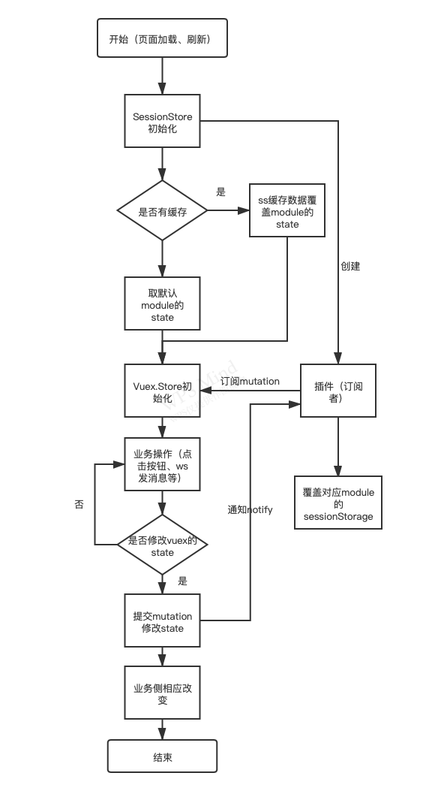

## vuex + sessionStorage 解决方案

#### 1.解决什么问题

- vuex 数据状态在页面刷新后丢失，造成关键现场丢失

#### 2.具体实现

- vuex 使用module 命名空间方式维护 (文件名称即为 module的命名空间)

  ```javascript
  //global.js
  import * as Types from '../mutation-types'
  
  const state = {
    redBag: {
      //红包类型
      redType: 'Red_Ordinary'
    }
  }
  const mutations = {
    [Types.global.SAVE_REDBAG_TYPE]: (state, payload) => {
      state.redBag.redType = payload.redType
    }
  }
  const actions = {
    saveRedBagType ({commit}, payload) {
      commit(Types.global.SAVE_REDBAG_TYPE, payload)
    }
  }
  const getters = {
    getRedBagType: state => {
      return state.redBag.redType
    }
  }
  
  export default {
    namespaced: true,
    state,
    mutations,
    actions,
    getters,
  }
  ```

  

- vuex的mutation的key单独定义到文件

  ```javascript
  //mutation-types.js
  /**
   * 全局变量 对象名即为命名空间 跟modules文件夹下文件同名
   */
  export const global = {
    SAVE_REDBAG_TYPE: 'SAVE_REDBAG_TYPE'
  }
  ```

- modules/index.js  modules出口

  ```javascript
  //动态导入 推荐
  const files = require.context('.', false, /\.js$/)
  const modules = {}
  
  files.keys().forEach((key) => {
    if (key === './index.js') {
      return
    }
    modules[key.replace(/(\.\/|\.js)/g, '')] = files(key).default
  })
  export default modules
  
  //静态定义
  import global from 'global'
  export defatul {
    global
  }
  ```

  

- sessionStore 类的具体实现

  - 构造函数有两个参数 modules (modules/index.js 导出的对象)和 types（mutation-types.js 导出的对象）

  - 执行_init 获取sessionStorage的缓存数据替换modules的state状态数据

  - getPlugin 返回vuex插件，即注册mutation的订阅者 当vuex数据变化时，通知执行覆盖sessionStorage相应module的值

    ```javascript
    /*
     * @Author: zhangjiangpo 
     * @Date: 2021-01-28 15:16:56 
     * @Last Modified by: 
     * @Last Modified time: 2021-01-29 10:34:54
     *  vuex 状态值关联到 sessionStorage 中
     * 
     * 
      **
       * 
       * @param {*} modules vuex module对象
       * @param {*} types   格式必须是如下格式：
       * 
       *  export const global = { //对象名即为命名空间
            SAVE_REDBAG_TYPE: 'SAVE_REDBAG_TYPE'
          }
       *
        const ss = new SessionStore(modules, types)
        new Vuex.Store({
          modules: ss.modules,
          plugins: [ss.getPlugin()]
        })
     */
    export default class SessionStore{
      constructor(modules = {}, types = {}) {
        this.modules = modules;
        this.types = types
        this.prefix = "SESSION_STORE_";
        this._init()
      }
      _init() {
        // 有缓存 取缓存的值覆盖 module.state
        Object.keys(this.modules).forEach(moduleKey => {
          let state = this._getModuleState(moduleKey)
          if(state) {
            this.modules[moduleKey].state = state
          }
        })
      }
      _getModuleState(key) {
        let moduleStateStr = sessionStorage.getItem(this.prefix + key);
        try{
          return JSON.parse(moduleStateStr)
        } catch(e) {
          console.warn('get session store fail ' + JSON.stringify(e))
          return null
        }
      }
      _saveModuleState(key, value) {
        try{
          sessionStorage.setItem(this.prefix + key, JSON.stringify(value));
        } catch(e) {
          console.warn('set session store fail ' + JSON.stringify(e))
        }
      }
      getPlugin(){
        return store => {
          store.subscribe((mutation, state) => {
            // 每次 mutation 之后调用
            // mutation 的格式为 { type, payload }
            Object.keys(this.types).forEach(key => {
              if(mutation.type.indexOf(key + '/') >= 0){
                this._saveModuleState(key, state[key])
              }
            })
          })
        }
      }
    }
    ```

    

- sessionStore 类的使用

  ```javascript
  import modules from './modules'
  import * as types from './mutation-types'
  import SessionStore from './sessionStore'
  const ss = new SessionStore(modules, types)
  export default new Vuex.Store({
    modules: ss.modules,
    plugins: [ss.getPlugin()]
  })
  ```

#### 3.其他解决方案思路

- Object.defineProperty 重写get\set   与vue的数据劫持冲突
- 在vuex module的mutation和getter 里面 写逻辑代码判断   
  - 侵入式修改不提倡 
  - 应用项目接入比较费力
- mutation监听 + 高阶函数实现getter的拦截器

#### 4.现有问题

- state数据量大 + mutation频繁触发， 会频繁的sessionStorage写（I\O操作） 会有性能问题
  - 优化modules 的颗粒度更小些
  - 防抖 + （队列（每次mutation压入） +  window.onbeforeunload（执行队列未执行的， 兼容性 和 用户无操作不触发））

#### 5.流程图

